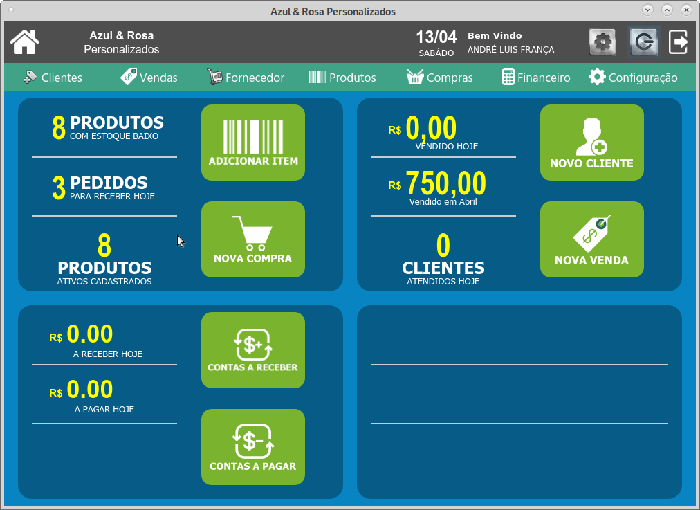
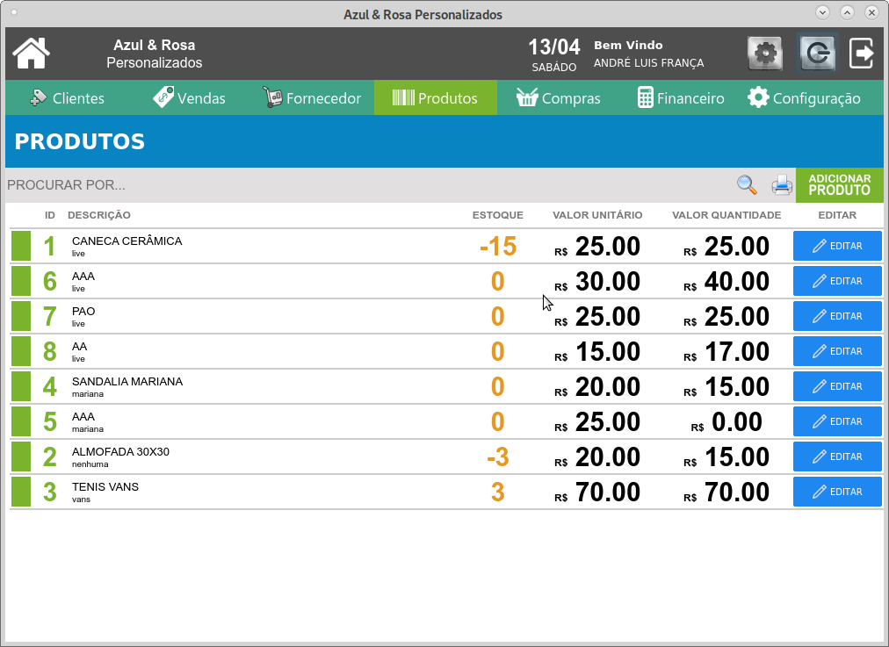
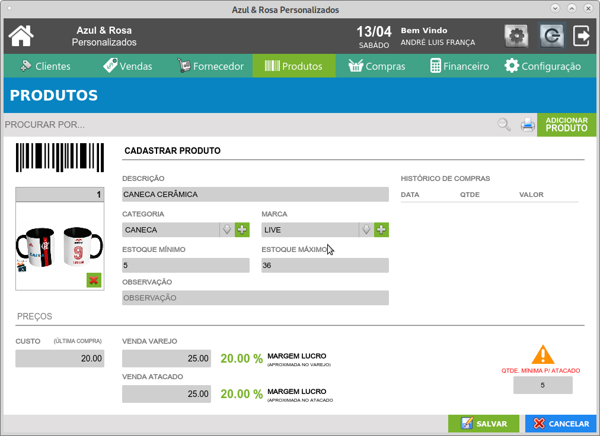
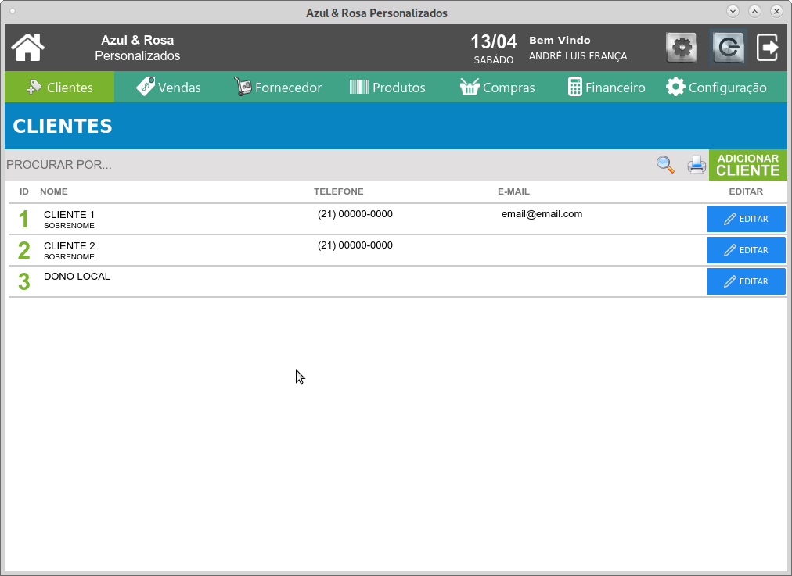
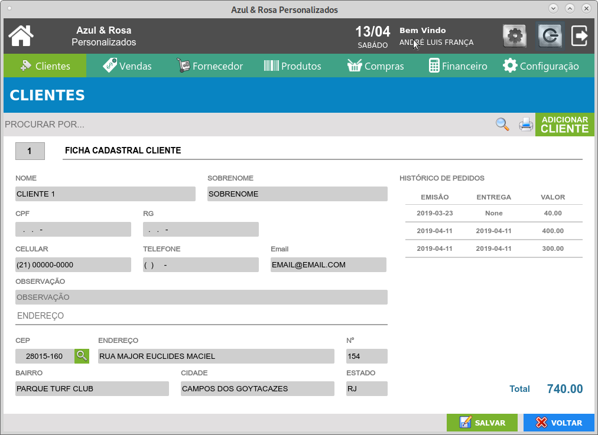
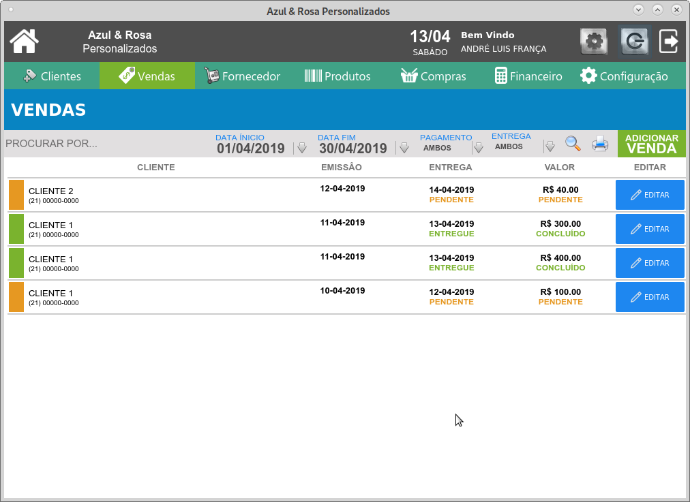
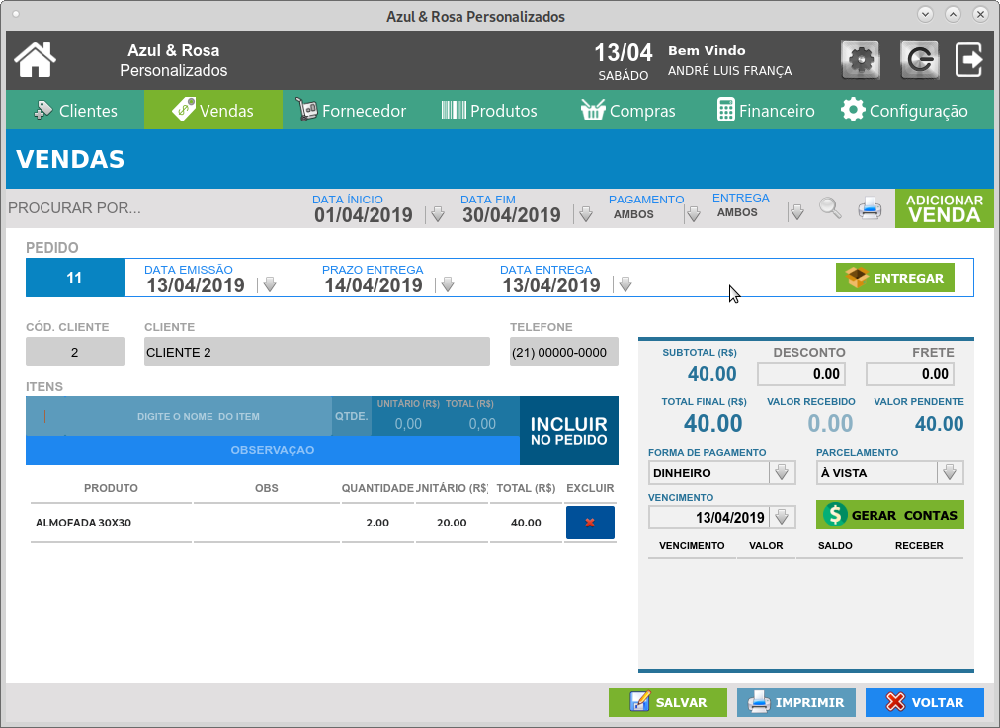
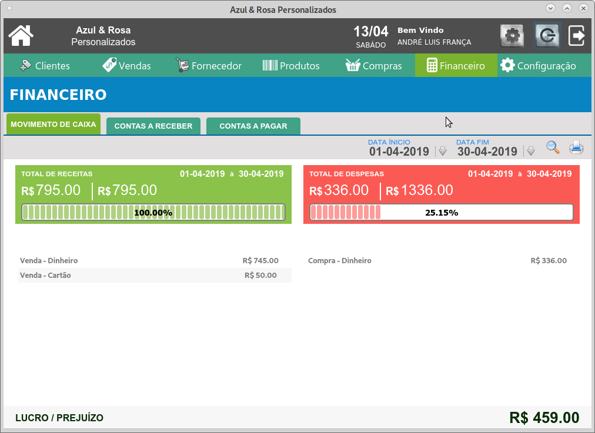

# Controle De Estoque e Vendas
> Cadastro de Produtos, Clientes e Fornecedores, Vendas, Contas a pagar e receber

 [](https://www.python.org/downloads/release/python-360/) [](http://opensource.org/licenses/MIT)

Sistema desenvolvido com foco na facilidade e agilidade de uso.  


## Instalação

OS X & Linux:

```sh
pip install -r requeriments.txt
```

## Telas do Sistema

 Tela Inicial


 Lista de Produtos
 

 Cadastro de Produto
 

 Lista de Clientes
 

 Cadastro de Clientes
 

 Lista de Vendas
 

 Nova Venda
 

 Resumo Financeiro
 


## Configuração para Desenvolvimento

Para desenvolvimento instale todas as dependências 

```sh
pip install -r requirements-dev.txt
```

## Histórico de lançamentos

* 0.0.1
    * Trabalho em andamento

## Meta

Dinah Martins –  – negociosdinah@gmail.com


# Este sistema funciona melhor na versão 3.8v do Python3

# Após configurar o requirements.txt e  requirements-dev.txt

# pip uninstall SQLAlchemy

# pip install SQLAlchemy==1.3.24

# pip uninstall Jinja2

# pip install Jinja2==3.0.2

## Instale o MySQL Installer Comunity

## Instale o WorkBench
